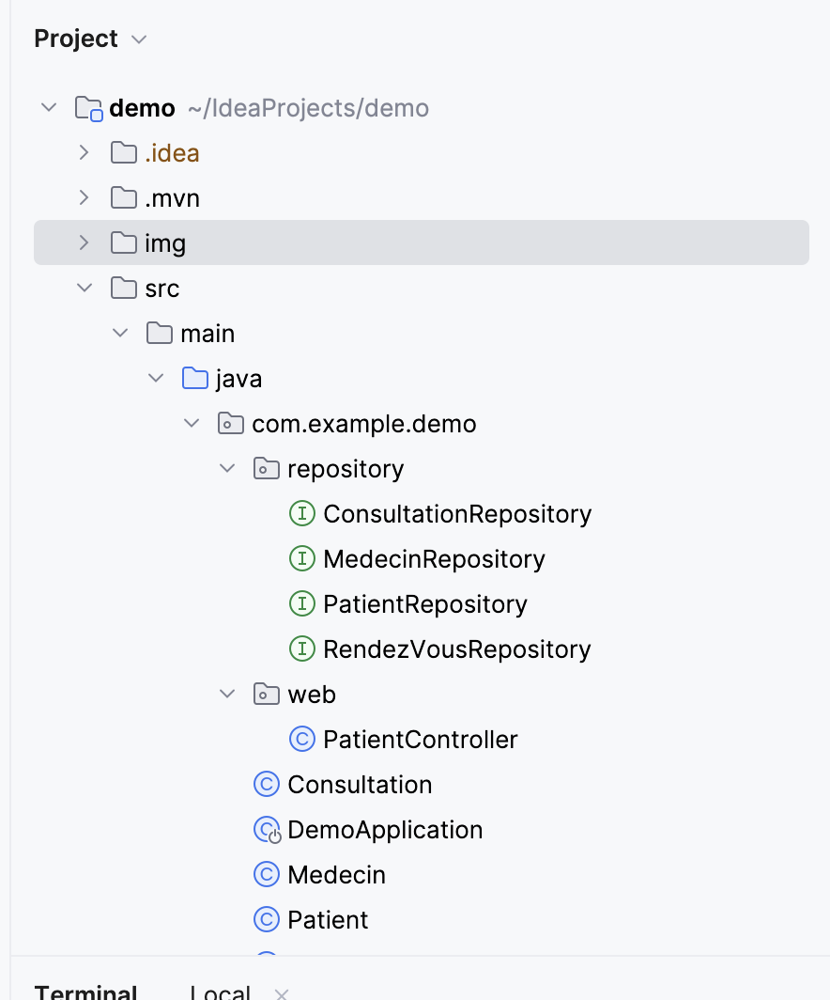
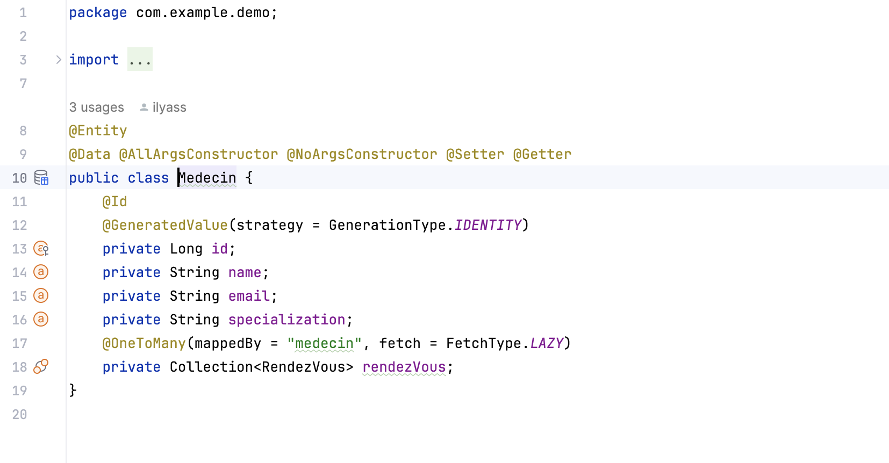
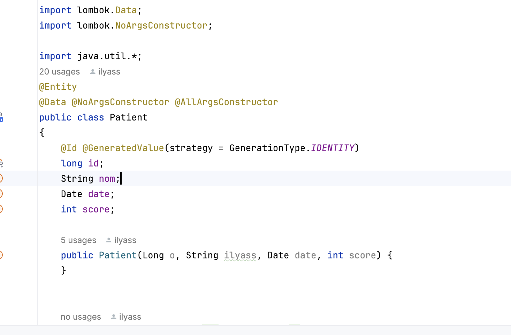
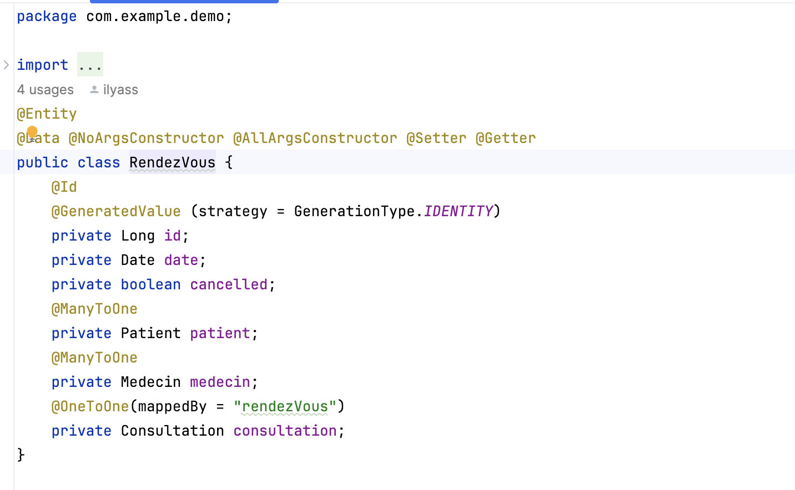
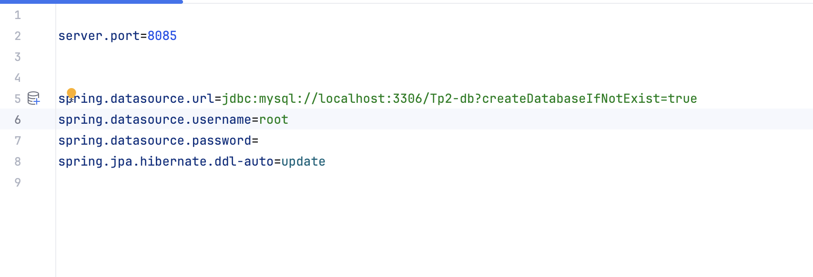
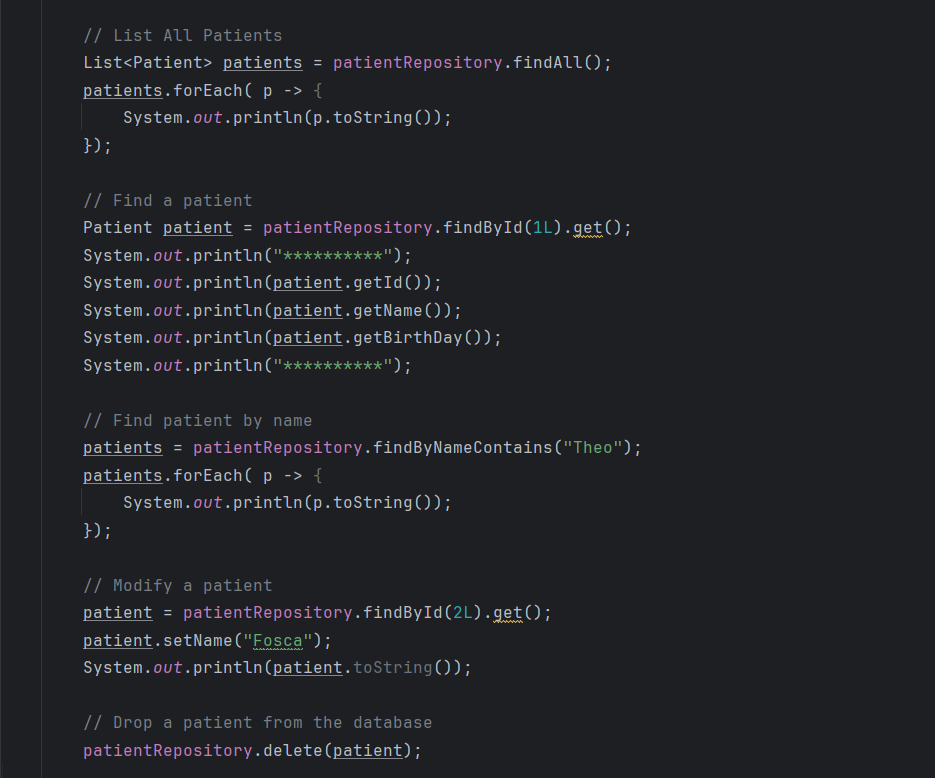

# Compte Rendu

## Introduction

Une application informatique doit etre évolutif, fermée à la modification et ouverte á l'extension. En plus toute application doit etre capable de gérer des bases de données.
Ceci peut être realisé en utilisant:
- Spring Data
- H2 Database
- MySQL
- JPA

## Enonce

Ce TP consiste à mettre en œuvre une application de gestion d'un hopital. On utilisera une base de données MySQL pour stocker nos tables.

## Conception

## Capture D'ecran

##### Architecture Du Projet

##### Classes
###### Consultation

###### Medecin

###### Patient

###### Rendez-Vous

##### Implementation MySQL Data Base

#### Implementation des methodes

